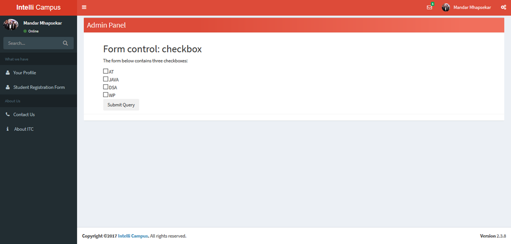
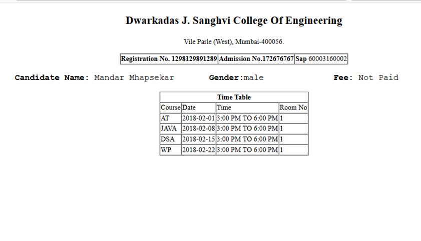
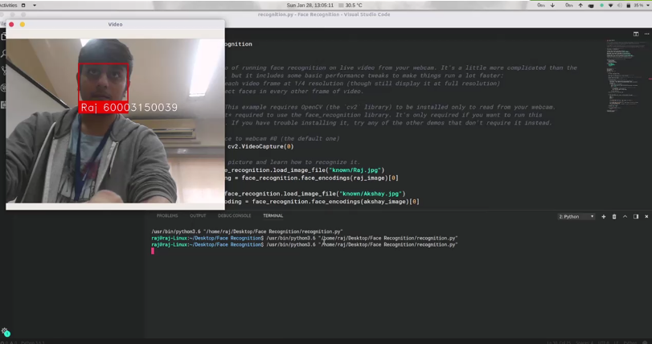
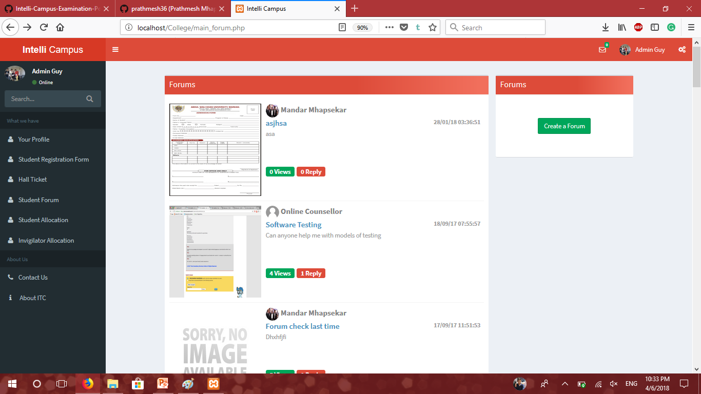
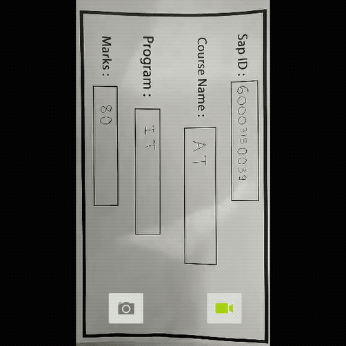
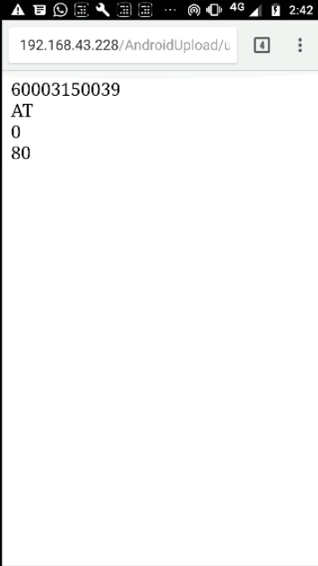
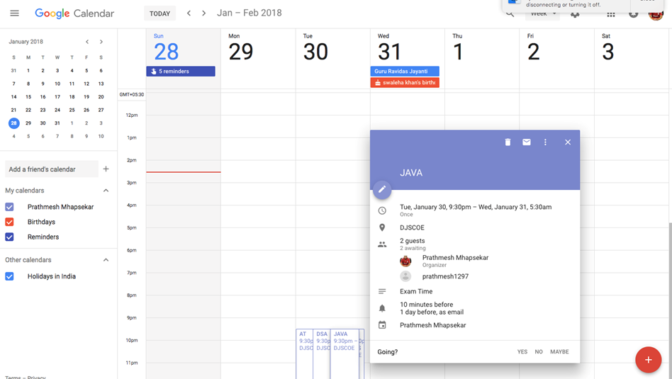

# IntelliCampus Extension (Examination Management) Developed for CodeShastra 4.0 Round 0
Since education is a powerful instrument of social change and human progress, it is also a powerful tool to cultivate values in an individual. Therefore all the educational institutes have greater responsibility to impart learning and cultivating values through education. To have this impactful change we need to have smart Educational Institutes. Our Nation is currently going through a “Digital Revolution” and this revolution must be brought in the institutions.   
    Today many of our Educational Institutes face the problems such as inadequate resources to get the quality education, less eco-friendly, improper library facilities, lack of distance education for the remote areas, lack of education for students with special needs and poor counseling for students to handle academic pressure.
    To overcome all this hindrance that becomes the hurdle in the way of our institutions to adapt to this era of digitization, we have implemented some economical and feasible solutions that will help to provide equal education and more opportunities to upcoming youth in our Learning Management System Called [Intelli Campus](https://github.com/prathmesh36/IntelliCampus-Web) whereas this Project serves as an Extension to the Intelli Campus LMS by providing all examination management features like
* Exam Registration using Student account.
* Automatically generated Hall Ticket available for download to Students on portal.
* Student Identity Verfication App for Exam Supervisor based on Identity card Barcode.
* Google Calendar API Integration with Exam TimeTable for getting timely updates about exams.
* Exam Timetable Generator considering dates and available rooms.
* Corrected Paper Marks Uploading App using Image Processing based App (Google Cloud Vision API)

## Getting Started

* After cloning the project you need to import the project's database from DB Folder into phpmyadmin of your local machine.
* Now you are ready to run the project on your local machine.
* The Project uses Google Calendar & Cloud Vision API so you need to setup account on google cloud platform and get the required credential for the used API.
* You will also be required to give your billing details to set a billing account to avail the free service of Google Cloud Vision API. Click Here to know more.
* Once the billing account is set get credentials for Google Cloud Vision and put it in the GVision Vendor folder.

### Prerequisites
* [Android Studio 2.0 or above](https://developer.android.com/studio/index.html)
* [XAMPP PHP 5.6 or above](https://www.apachefriends.org/download.html)
* Android Phone | Requirement : Lolipop 5.0 or above, Camera.

## Demo

### Exam Registration Page

### Automatically Generated Hall Tickets

### Exam Timetable generation

### Student Verfication App using ID Card Barcode

### Student Verification using Facial Recognition

### Student Discussion Forum 

### Corrected Papers Marks Uploading

### Exam Timetable integration with Google Calendar on your phone

## Built With
* [Andrid Camera2 API](https://developer.android.com/reference/android/hardware/camera2/package-summary.html)
* [Google Cloud Vision](https://cloud.google.com/vision/) - Intelligent Text Recognition.
* [Google Calendar API](https://developers.google.com/calendar/) - Intelligent Text Recognition.
* Admin LTE 2 Bootstrap Template

## Authors

* **Mandar Mhapsekar**-[mandar10](https://github.com/mandar10)
* **Prathmesh Mhapsekar**-[prathmesh36](https://github.com/prathmesh36 )
* **Raj Patel**
* **Aniket Mhatre**

## License

This project is licensed under the MIT License - see the [LICENSE.md](LICENSE.md) file for details
